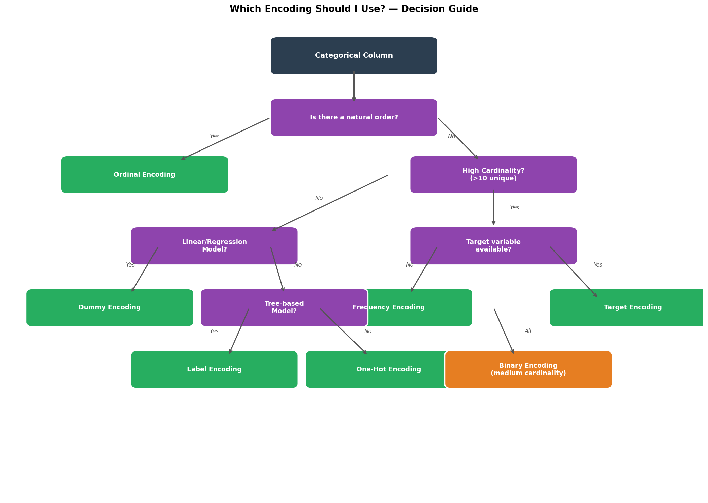
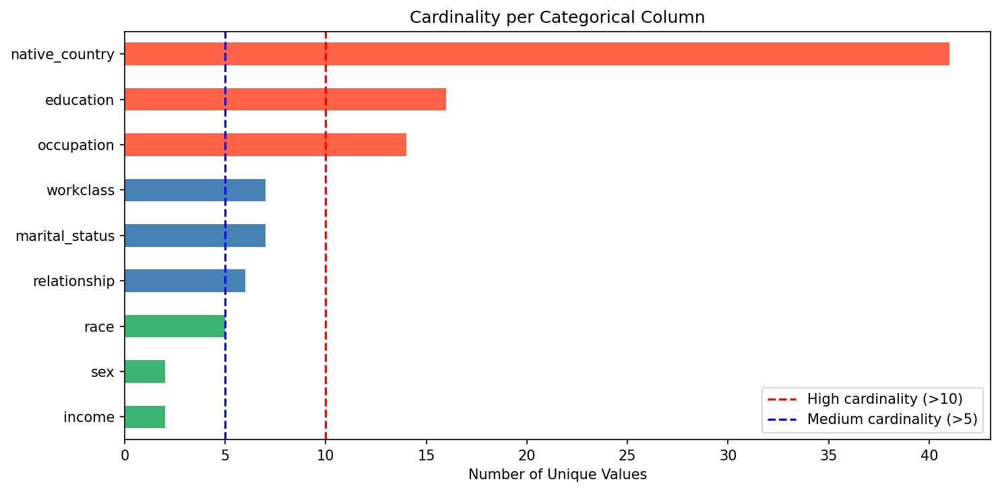
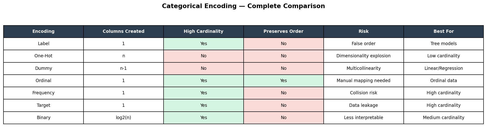
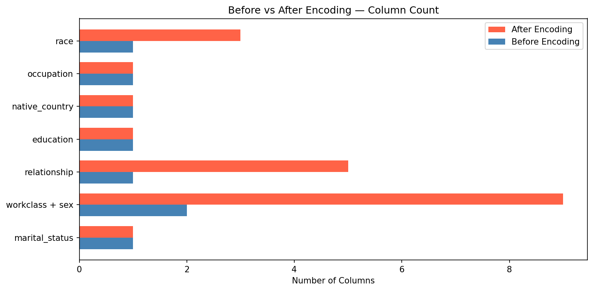

# Categorical Encoding Showdown

> **Stop Using One-Hot Encoding for Everything — Here's What to Use Instead**

A comprehensive, hands-on guide to 7 categorical encoding techniques
applied on the real-world Adult Income dataset. This project helps data
scientists and ML engineers make informed encoding decisions rather than
defaulting to One-Hot encoding for everything.

---

## Medium Blog

Read the full blog post here →

---

## What This Project Covers

| Encoding           | Column Used    | Cardinality | Best For            |
| ------------------ | -------------- | ----------- | ------------------- |
| Label Encoding     | marital_status | Low         | Tree models         |
| One-Hot Encoding   | workclass, sex | Low         | Low cardinality     |
| Dummy Encoding     | relationship   | Low         | Linear/Regression   |
| Ordinal Encoding   | education      | Medium      | Ranked categories   |
| Frequency Encoding | native_country | High        | High cardinality    |
| Target Encoding    | occupation     | Medium      | Supervised learning |
| Binary Encoding    | race           | Low-Medium  | Medium cardinality  |

---

## Dataset

**Adult Income Dataset** — UCI Machine Learning Repository

- 32,561 rows, 15 columns
- Target: Predict whether income exceeds $50K/year
- Source: [Kaggle](https://www.kaggle.com/datasets/uciml/adult-census-income)

---

## Project Structure

```plaintext

categorical-encoding-showdown/
│
├── src/
│ ├── **init**.py
│ ├── data_loader.py
│ ├── encoders.py
│ ├── visualize.py
│ └── compare.py
├── data/
│ └── adult.csv
├── images/
├── notebook.ipynb
├── main.py
├── pyproject.toml
└── requirements.txt

```

---

## Setup & Installation

### Using UV (Recommended)

```bash
git clone https://github.com/yubrajparajuli/categorical-encoding-showdown.git
cd categorical-encoding-showdown
uv venv
source .venv/bin/activate
uv sync
```

### Using pip

    pip install -r requirements.txt

---

## Run The Project

### Option 1 — Full Pipeline

    python main.py

Runs all encodings and saves all plots to `images/` automatically.

### Option 2 — Notebook

    jupyter notebook

Open `notebook.ipynb` for step-by-step walkthrough with explanations.

---

## Key Visualizations

### Which Encoding Should I Use? — Decision Flowchart



### Cardinality Per Categorical Column



### Complete Encoding Comparison Table



### Before vs After Encoding



---

## Key Takeaways

- One-Hot is not always the best choice
- High cardinality columns need Target or Frequency encoding
- Ordinal columns need manually defined order — not Label encoding
- Tree models can handle Label encoding — linear models cannot
- Binary encoding is an efficient middle ground for medium cardinality

---

## Tech Stack

| Tool              | Purpose                  |
| ----------------- | ------------------------ |
| Python 3.11       | Core language            |
| pandas            | Data manipulation        |
| numpy             | Numerical computing      |
| scikit-learn      | Label & Ordinal encoding |
| category_encoders | Binary & Target encoding |
| matplotlib        | Visualizations           |
| seaborn           | Heatmaps                 |
| jupyter           | Notebook interface       |

---

## License

MIT License — feel free to use and modify!

```

```
